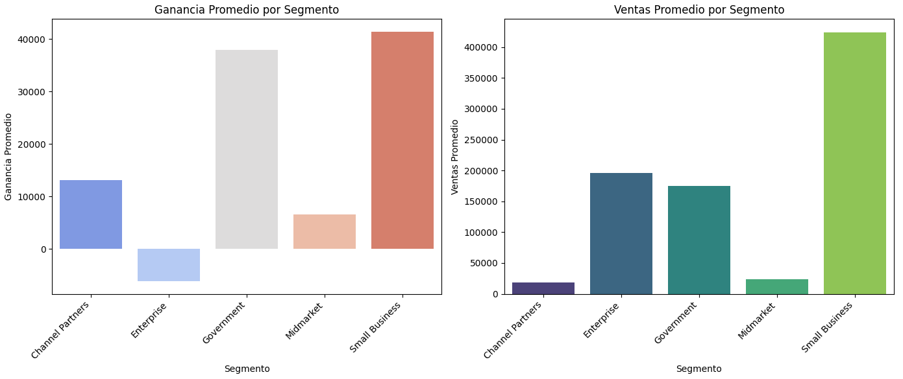
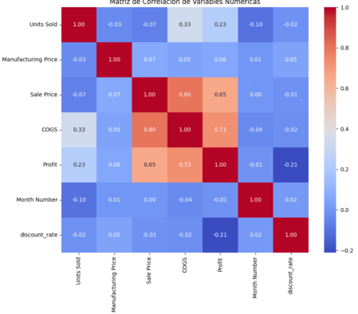

# 📊 Análisis Financiero y Riesgo de Crédito

## 📝 1. Análisis de Datos Financieros

En este proyecto se realizó un análisis exhaustivo de datos financieros utilizando **Python** y su ecosistema de librerías especializadas, cubriendo desde la preparación inicial de los datos hasta su puesta a punto para el modelado predictivo.

### 🔍 Análisis Exploratorio de Datos (EDA) y Preprocesamiento
* **Tratamiento de Datos Faltantes:** Se llevó a cabo un proceso riguroso de limpieza mediante la imputación de datos utilizando la **media** para variables numéricas y la **moda** para las categóricas.
* **Agrupaciones y Visualización:** A través de operaciones de agregación (`groupby`), se examinaron los patrones de comportamiento de las variables clave del negocio.

### 💡 Hallazgo Clave (Insight)
Durante la fase de exploración se identificó una anomalía crítica: **las ganancias promedio del segmento "Empresa" resultaron ser negativas**, a pesar de que sus ventas promedio se posicionaban como las segundas más importantes del negocio, solo por detrás del segmento de "Pequeños Negocios". 

A continuación se presenta la visualización que justifica y demuestra esta conclusión:

### ⚙️ Ingeniería de Características y Preparación para Machine Learning
Para garantizar la calidad de los datos antes de ser transferidos a un modelo predictivo de Machine Learning, se aplicaron las siguientes técnicas de ingeniería de características:
* **Codificación de Variables:** Se transformaron las variables categóricas mediante la técnica de *One-Hot Encoding*.
* **Control de Multicolinealidad:** Se evaluó el Factor de Inflación de la Varianza (**VIF**) para identificar y remover características altamente correlacionadas, asegurando la estabilidad de un futuro modelo.

Aquí se puede observar la estructura final de relaciones del conjunto de datos procesado (pasamos de 10 carácteristicas a 7):

---

## 🛡️ 2. Análisis de Datos de Riesgo Crediticio

> 🚧 **Proyecto en Desarrollo**
> Actualmente me encuentro trabajando en esta sección. Aquí se incluirá el análisis detallado, la metodología de evaluación del riesgo de crédito y los modelos de regresión aplicados.

### ⚙️ Ingeniería de Características y Selección de Variables
Para garantizar la calidad de los datos antes de entrenar los modelos predictivos, se aplicó un pipeline completo de preparación:
* **Codificación de Variables:** Transformación de características categóricas para su correcto procesamiento numérico.
* **Reducción de Multicolinealidad:** Se analizó la relación entre variables mediante una **matriz de correlación** y el cálculo del Factor de Inflación de la Varianza (**VIF**).
* **Selección de Atributos:** Gracias a este proceso, **logramos reducir el set de variables de 26 a solo 10**, seleccionando únicamente las más útiles para la construcción de los modelos.

### 🤖 Modelado Predictivo y Regularización
Una vez refinado el conjunto de datos, se procedió a la fase de experimentación y entrenamiento:

1. **Modelos Base:** Se implementaron y compararon modelos de **Regresión Lineal Simple** y **Regresión Polinómica**.
2. **Evaluación:** El desempeño de cada estructura se midió rigurosamente utilizando el Error Cuadrático Medio (**MSE**).
3. **Optimización (Regularización):** Finalmente, aplicamos técnicas de regularización **Ridge (L2)** y **Lasso (L1)** con el objetivo de mitigar el sobreajuste (overfitting) y maximizar la capacidad de generalización de los modelos con datos nuevos.

---
🔗 *[Volver al menú principal](../README.md)*
