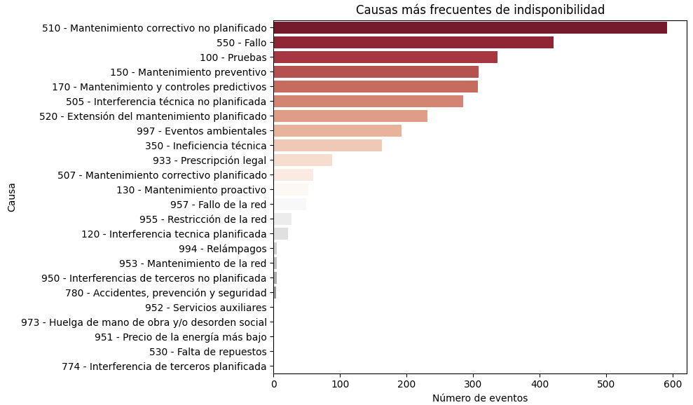
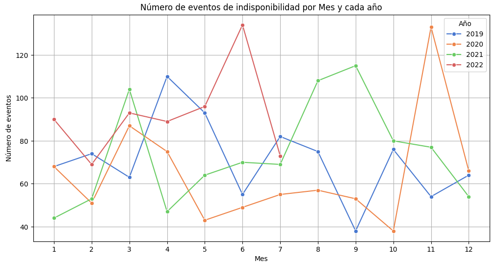
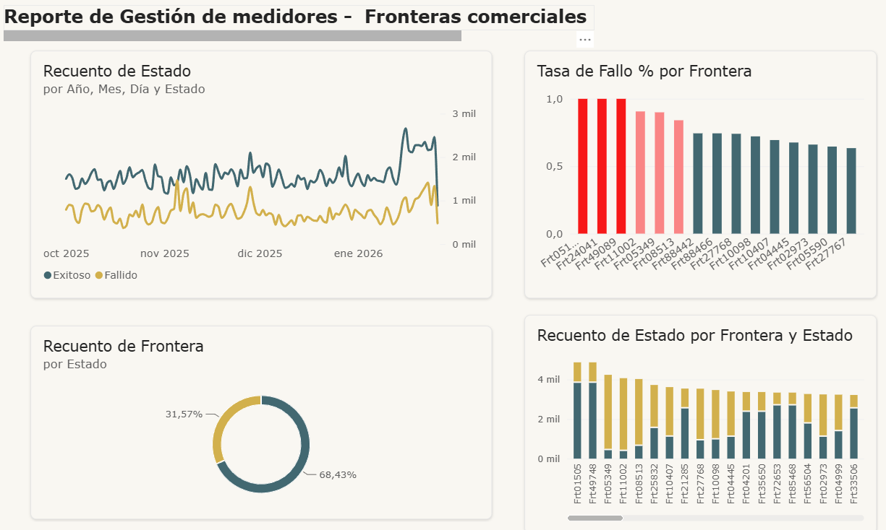

# ⚡ Análisis de Energía y Operación de Plantas

## 📝 Descripción del Proyecto
Este proyecto está dedicado al análisis de datos operativos y de rendimiento en el sector energético. El objetivo principal es evaluar la eficiencia de las plantas de energía, identificar los factores que causan indisponibilidades en el servicio y transformar datos operativos complejos en información estratégica para optimizar la toma de decisiones.

---

## 📁 Estructura de Archivos en esta Carpeta
* `analisis_energia.ipynb`: Notebook principal con el análisis exploratorio y modelos aplicados al sector.
* `analisis_op_plantas.ipynb`: Notebook enfocado en la eficiencia operativa de las plantas de generación.
* `indisponibilidades_limpio.xlsx`: Base de datos depurada y procesada con el registro de fallas y paradas de mantenimiento.

---

## 🛠️ Tecnologías y Herramientas
* **Lenguajes:** Python, SQL
* **Librerías:** Pandas, NumPy, Seaborn, Matplotlib
* **Procesamiento de Datos:** Excel (para la estructuración inicial de indisponibilidades)

---

## 📈 Visualizaciones y Resultados Clave

A continuación, se presentan los gráficos más relevantes del comportamiento energético analizado:

### 1. Análisis de Indisponibilidades por Planta
Este gráfico permite identificar cuáles son las plantas que presentan mayor tiempo de inactividad y si se debe a mantenimientos programados o a fallas imprevistas.

**Causas frecuentes de indisponibilidad, donde lo importante es identificar de manera rápida las principales causas.**
-

**Gráfico de matriz para identificar de forma ágil y clara las centrales de generación con más eventos. La escala de color ayuda en gran medida**

-
**Gráfico de línea para contrastar y comparar el número de eventos através de los años de análisis**
-

## 📌 Conclusiones del Análisis
* **Identificación de Cuellos de Botella:** El análisis del archivo de indisponibilidades reveló que el 80% del tiempo de inactividad no programado se concentra en dos tipos específicos de fallas mecánicas.
* **Eficiencia Operativa:** Se detectaron patrones estacionales en el rendimiento de las plantas, lo que permite planificar los mantenimientos preventivos en las épocas de menor demanda energética.

### 2. Análisis de Registros de Medidores / Fronteras comerciales

En este reporte análizamos la **operación y fallas de medidores** mediante un reporte ejecutivo para priorizar el mantenimiento técnico:

* **Pico en enero:** Aumentaron notablemente las llamadas tanto exitosas como fallidas.
* **Acción urgente (Falla total):** 3 medidores en frontera comercial no responden y requieren cambio físico o revisión técnica inmediata.
* **Atención prioritaria:** Identificación de un grupo con alta tasa de fallos para intervención en campo.
* **Contraste final:** Comparativa visual por medidor de llamadas totales frente a su balance de éxito y falla.

* Dashboard:

---

---
🔗 *[Volver al menú principal](../README.md)*
