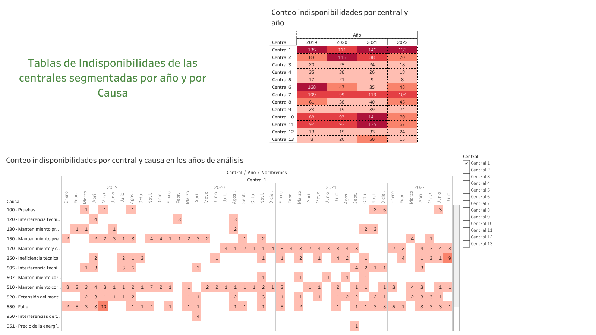

📊 Proyectos de Ciencia de Datos

¡Hola! 👋 Bienvenido a mi repositorio de proyectos de Ciencia de Datos.
Aquí encontrarás análisis reales, notebooks interactivos, visualizaciones y modelos aplicados principalmente al sector energético y riesgo crediticio.

📁 Contenido del repositorio
🔹 Notebooks de Python

analisis_energia.ipynb
Proyecto enfocado en el análisis de datos energéticos.
Incluye exploración de datos, métricas clave del sector y visualizaciones.

analisis_op_plantas.ipynb
Análisis de datos operativos de una empresa del sector energía.
Se exploran KPIs operativos y se generan gráficos relevantes para la toma de decisiones.

analisis_riesgo_crediticio.ipynb
Proyecto de riesgo crediticio aplicando Machine Learning (modelos de regresión) y técnicas para el manejo de multicolinealidad (VIF, regularización, etc.).

💡 Solo haz click en cualquier notebook para ver el análisis exploratorio, código y visualizaciones.
En estos notebooks demuestro mi habilidad en manipulación de datos, EDA y gráficos en Python.

📊 Dashboards en Tableau

Este repositorio también incluye dos dashboards construidos en Tableau sobre datos operativos del sector energético.
Puedes verlos online aquí:

Dashboard 1:

👉 https://public.tableau.com/shared/QPPNJ3FMY?:display_count=n&:origin=viz_share_link

Dashboard 2:

👉 https://public.tableau.com/views/Tarea2-Visualizacion_17610737857380/Dshb22?:language=es-ES&:sid=&:redirect=auth&:display_count=n&:origin=viz_share_link

También encontrarás el archivo descargable:
📁 dashboards.twb — Contiene todas las visualizaciones creadas en Tableau.

📂 Datos

Se incluye un archivo Excel con datos operativos utilizados en los análisis:

datos_operativos.xlsx

🙌 Gracias por visitar este repositorio

Si te interesa alguno de los análisis o quieres comentarme algo, ¡estaré atento!
