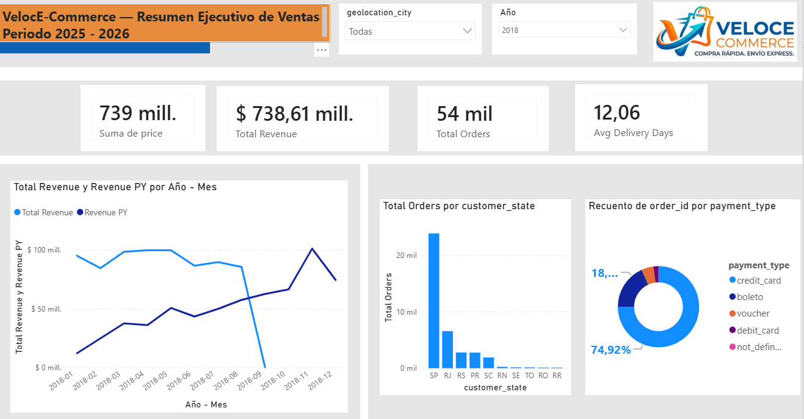
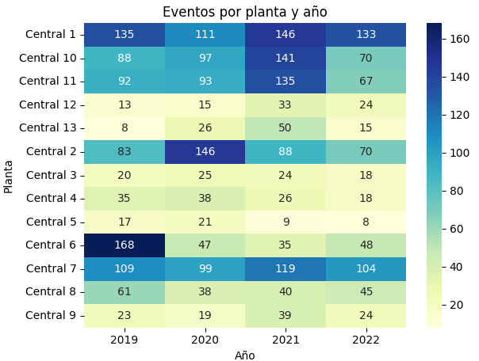

# 🚀 Portafolio de Proyectos en Ciencia de Datos

¡Hola! Bienvenido a mi repositorio de proyectos. Aquí encontrarás proyectos de análisis de datos, ingeniería de características y modelado predictivo aplicados a diferentes sectores de negocio. 

Mi enfoque está centrado en transformar datos complejos en decisiones estratégicas, utilizando herramientas modernas de programación y visualización.

---

## 🛠️ Stack Tecnológico General
* **Lenguajes:** Python (Pandas, NumPy, Scikit-Learn, Seaborn), SQL.
* **Herramientas de BI & Datos:** Excel Avanzado, Power BI, Tableau.
* **Entornos:** Jupyter Notebooks, Git/GitHub.

---

## 📂 Resumen y Acceso a los Proyectos

Haz clic en el título de cada sección para explorar el código, las visualizaciones y las conclusiones detalladas de cada proyecto:

### 📊 [1. Análisis Comercial / Financiero / Riesgo de Crédito](./01_analisis_financiero)
* **¿De qué tratan los proyectos?**
* Un proyecto en el que utilizo una base de datos comerciales, preparo los datos, realizo manipulación, modelado de datos y visualizaciones desde basicas hasta complejas, mediante Power BI.
* Un pipeline completo de ciencia de datos donde abordo el preprocesamiento de datos financieros, el control de multicolinealidad (VIF) y la reducción estratégica de variables (de 26 a 10). Además, implemento y comparo modelos de regresión lineal, polinómica y técnicas de regularización (Ridge/Lasso) para mitigar el sobreajuste.
* **Insight Clave:** Identificación de pérdidas ocultas en el segmento de clientes "Empresa" a pesar de su alto volumen de ventas.

.
  

### ⚡ [2. Análisis de Energía y Operación de Plantas](./02_analisis_energia)
* **¿De qué trata?** Análisis del rendimiento de plantas de generación eléctrica y optimización operativa. Incluye el procesamiento y limpieza de registros de fallas para identificar las causas raíz de la inactividad y planificar mantenimientos preventivos.
* **Insight Clave:** Identificación de patrones estacionales de demanda y cuellos de botella mecánicos que acumulaban el 80% del tiempo de inactividad no programado.

.

### ⚡ [3. Proyectos relacionados a Inteligencia Artificial](./03_ai_applications)
* **¿De qué trata?** 🤖 Repositorio de proyectos enfocados en **AI Engineering**, donde se desarrollan aplicaciones y servicios utilizando **Python**, **FastAPI** y **modelos de inteligencia artificial**. 🚀 Los proyectos incluyen integración con **LLMs**, desarrollo de **APIs REST**, procesamiento de lenguaje natural (PLN/NLP), automatización de procesos, análisis de texto y soluciones orientadas a datos. 📊 El objetivo es aplicar **buenas prácticas de desarrollo**, arquitecturas escalables y herramientas modernas de IA para construir soluciones prácticas e integrarlas en aplicaciones reales.

---

## 📫 Contacto y Conectividad
* **LinkedIn:** [Ingeniero/ Analista Bayron Andrés Guamá](https://www.linkedin.com/in/bayron-a-guamá-5651bb364) 
